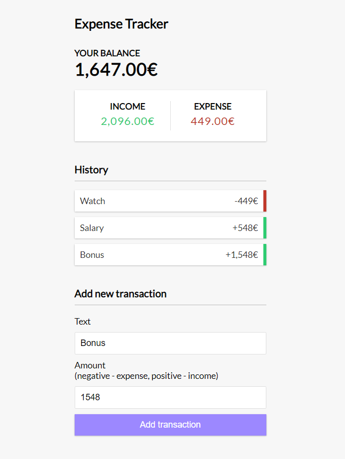

# MERN - expense tracker with comments

## Step 1

### Install required dependencies using npm

> `npm i express dotenv mongoose colors morgan`

| Dependancy |                                                                                      Description                                                                                       |                       Link |
| :--------- | :------------------------------------------------------------------------------------------------------------------------------------------------------------------------------------: | -------------------------: |
| express    |                                                                         small, robust tooling for HTTP servers                                                                         |  npmjs.com/package/express |
| dotenv     |                                                                        loads environment variables from a .env                                                                         |   npmjs.com/package/dotenv |
| mongoose   | Mongoose is an object datamap. Basically its a layer that we can use to interact with our database, we can create a model for our transactions and we can make querys to our database. | npmjs.com/package/mongoose |
| colors     |                                                                    small module to have a color text in the console                                                                    |   npmjs.com/package/colors |
| morgan     |                                                                       HTTP request logger middleware for node.js                                                                       |   npmjs.com/package/morgan |

---

### Install dev dependencies

> `npm i -D nodemon concurrently`

| DevDependancy |                                                                    Description                                                                     |                           Link |
| :------------ | :------------------------------------------------------------------------------------------------------------------------------------------------: | -----------------------------: |
| nodemon       |                                         allow us to constantly run our server without having to restart it                                         |      npmjs.com/package/nodemon |
| concurrently  | allow us to run our backend server on a port :5000 and also our react dev server on another port :3000 at the same time with one single npm script | npmjs.com/package/concurrently |

---

> For our database we use MongoDBAtlas which is a cloud version of MongoDB

---

## Step 2

In **package.json** create scripts  
`"start": "node server"`,  
`"server": "nodemon server"`

`npm start` -> runs node server  
`npm run server` -> runs nodemon, which will constantly watch it. Reason we use server in script is because our entrypoint is called server.js

## Step 3

Setup **server.js** file  
Use POSTMAN to test

## Step 4

Create routes in a separate folder to maintain scalability.  
Create route and connect it to **server.js** using `app.use()`

## Step 5

Create controllers folder and add methods there and connect them to the routes

## Step 6

> Create and connect to database

1. Create account in www.mongodb.com and create a cluster, aws as provider. other settings as is.
2. In cluster-> collection -> addmyowndata- Database name expensetracker and collection name transactions.
3. To **connect** -> clusters -> connect -> connect your application -> copy connection string.
4. Add connection string to **config.env** `MONGO_URI=connectionstring`.
5. Replace password with your own password set up in MongoDB. Replace `<dbname>` with database name.
6. Connect it using `mongoose`: in config folder create new file **db.js** and add mongoose connection.
7. In **server.js** bring in connectDB from **db.js** and call it out.

> Node server should show if connection was successful.

## Step 7

> Create model

1. In root create folder models -> new file **Transaction.js**. Uppercase naming for models.
2. Create a schema and export it
3. Bring in model to **transactionController.js**, use `async await` with `try-catch`. Add success and error responses.
4. Test result in POSTMAN with `GET` request to `'http://localhost:5000/api/v1/transactions'`

## Step 8

> When we send data from the client its going to come in 'req.body.something'

1. In order to use req.body we need to add - body parser `middleware` - to our **server.js** with `app.use(express.json())`
2. Add try-catch with responses in **transactionController.js**.
3. Test catch error by `console.log(err)` and in POSTMAN make `POST` request with adding raw json params.
   `{ "text": "Payment", "amount":500 }`
4. Check with `GET` request is the data there.
5. Add validation errors and map them to let user know whats happening
6. Handle deleteTransaction - add server responses and deleteById

---

> By now backend should be done.

---

## Step 9

> Start working on client side

1. Use `concurrently` to run both React and Node servers at the same time

2. To shorter http requests to api endpoints we use `proxy` to shorten <http://localhost:5000/api/v1>  
   To do that add `"proxy": "http://localhost:5000"`
   to **client/package.json**
3. Then add some `scripts` to root **package.json**  
   ...to run the client use --prefix to run it in the client folder ->
   `"client": "npm start --prefix client"`  
   ...to run both servers at the same time ->
   `"dev": "concurrently \"npm run server\" \"npm run client\""`
4. Run both Node and React servers using `npm run dev` in root folder

## Step 10

> INTEGRATE FRONT + BACK

1. Install **Axios** to make requests from frontend to backend `cd client` -> `npm i axios`
2. Make requests through actions in client/src/context/**GlobalState.js**
3. Create new action to fetch transactions from the backend. Use `axios.get`
4. Dispatch result to reducer.
5. Create new case in **AppReducer.js** for `getTransaction` and for errors create 'TRANSACTION_ERROR' case
6. In `ADD_TRANSACTIONS` case, because were dealing with fetching from API, transactions takes in current state first and then we add `action.payload` to it.
7. Now it should be okay in **AppReducer.js**.
8. **In GlobalState.js** we have `getTransaction()` action and we need to pass it in to `GlobalContext.Provider`.  
   In Provider pass in also rest of the state, so we can access these in any of the components.  
   error = state.error // uses state, because they come from the state  
   loading = state.loading

## Step 11

Call `getTransactions()` from **TransactionsList.js**.  
Pull out `getTransactions` from the state in addition to `transactions`  
Import `useEffect` hook if you want to make any **_http request_** from the component  
Call `getTransactions()` from `useEffect` hook. Pass in empty array `[]` as an 2nd perim, otherwise its going to be an infinite loop.  
`Transactions` should be visible in frontend under transactions.

> ## How getTransactions work
>
> 1. We have our initial state in **GlobalState.js** where transactions are empty.
> 2. We have our action `GetTransactions()` which were calling from **TransactionList.js** using `useEffect` hook
> 3. In **GlobalState.js** `getTransactions()` fetches transactions from backend using `axios`, then we `dispatch` GET_TRANSACTIONS in our `reducer` and we send the data as the `payload`.
> 4. In the **AppReducer.js** in case: `'GET_TRANSACTIONS'` it changes the `state` -> it adds those transactions from the response to our global state.

---

### Sidestep

Implement `morgan` to **server.js** for logging
<https://www.npmjs.com/package/morgan>

---

## Step 12

### Delete transaction from database

Using _MongoDB_ means in database `id` is used as `_id` .  
So we need to change the `transaction.id` to `transaction._id` in **Transaction.js** (button) and **AppReducer.js** (case)

> Test if delete btn works and removes transaction from UI

Also we need to make calls to our database to delete from there as well  
In **GlobalState.js** modify`deleteTransaction action`

> Now deleting from UI should also remove from database

## Step 13

### Add transaction to database

In **GlobalState.js**  
`axios.post()` takes in 3 arguments:

1. `config` object with `headers` defined
2. `transaction` what comes from the input
   then we get the respond and dispatch it to reducer
3. as `payload` we put response data from post request

## Step 14

Add separators to numbers  
create a folder **utils** and file inside named **format.js**

## Step 15

Prepare for production:

1. `cd` to `client` folder
2. `npm run build`
3. `cd ..`
   > As we want to route to the route index.html then...
4. in **server.js**
   bring in `path` module to manipulate path names and make thing easier
5. In **config.env** set `NODE_ENV=production`
6. In **server.js** below api routes `check if production` and **set static folder** to a **build folder**
7. Have a route for everything and load `index.html` when hit
   > Now when we run `npm run start` in `root folder` only node server should be running.  
   > You can access it locally using <http://localhost:5000> in the browser.

Project should be now deployable using Heroku!

## STEP 16

Deploy using Heroku.

> When building only front-end application with React there is script called `create-react-app` and using `npm run build` it takes our React application and builds it out into static assets that we can just upload to any server. However we have backend as well so dealing with full-stack application is bit different.

Thats when HEROKU comes in...

In Heroku we dont have access to our front-end dev server(:3000) that `create-react-app` gives us.  
It's going to look our backend **server.js** file wich will run on Herokus port, but what we need to do is basically say unless we're hitting our API routes ('/api/v1/transactions') then we want to hit `index.html` file in **client/build** folder to load our front-end.
Also we're not going to make a **build** folder manually using npm run build  
Instead we're creating `postbuild` script that once we push our app to Heroku it will automatically do the build there
To achieve that:

1. Delete the **build** folder if exists
2. In **server.js** under last API route serve static assets if in production. Check **Step 15 (4-6)**
3. Create postbuild script in root(server) package.json `"heroku-postbuild": "NPM_CONFIG_PRODUCTION=false npm install --prefix client && npm run build --prefix client"` false because it doesnt run build script if set to true.
   --prefix client to run in client folder

> ### Screenshot

